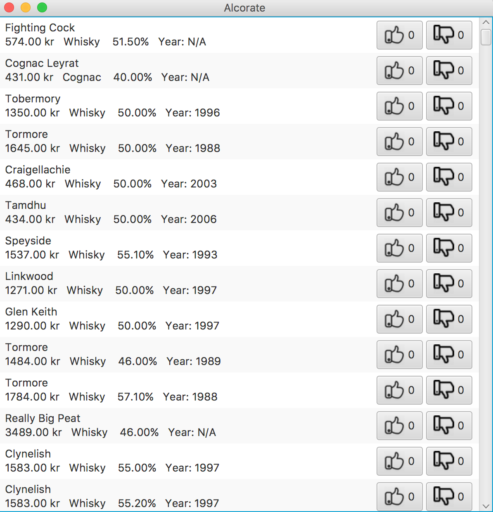

# Alcorate
This is a computer program where you can like / dislike a specifik whiskey or cognac that you have tried out. See which ones people like and get inspired to try out new beverages. The list of drinks in the program can get sorted by name, price, year, alcohol percentage and amount of likes, so that you can find the beverage that you are looking for more quickly. On the right hand side of the program, you can find the like and disklike button. Notice that you have to be of drinking age to use the program.

#### Scope
Each drink will have information on name, year, price, alcohol percentage and type of spirit. We will only be working with whiskey and cognac.

#### How to install
All files needed are in the repository. We are using Apache poi to read the excel file. The poi-3.16 folder needs to be added to the classpath of the project. The systemet.xls is the excel file from which the program will read which has been downloaded from systembolaget's website: https://www.systembolaget.se/api/ . The program runs from the Main class.

#### Design
The design will be made with JavaFX and will look something like this:

#### Testing strategy
The comparator classes and drink class are tested using Junit4. ExcelReader and Products are dependent of the excel file and have therefor been tested using print statements to ensure they read the excel file correctly. The Main class make use of a lot of the other classes and it's own functionality is only using JavaFX stuff, which we have tested by running the program a lot of times. 
