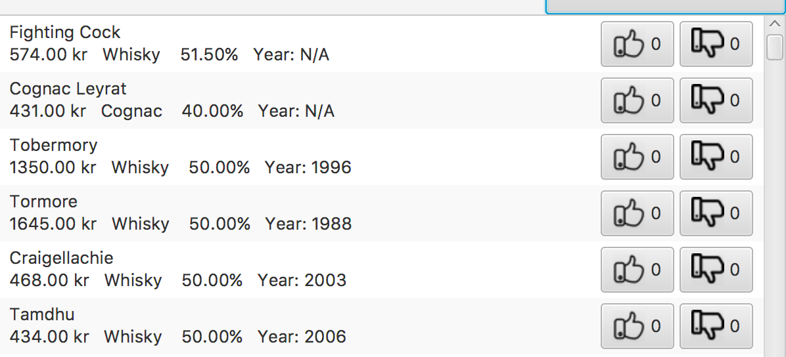

# Alcorate
This is a computer program where you can like / dislike a specifik whiskey or cognac that you have tried out. See which ones people like and get inspired to try out new beverages. The list of drinks in the program can get sorted by name, price, year, alcohol percentage and amount of likes, so that you can find the beverage that you are looking for more quickly. On the right hand side of the program, you can find the like and disklike button. Notice that you have to be of drinking age to use the program.

#### How to install
Download Apache POI from http://poi.apache.org/download.html#POI-3.16, binary distribution .gz. Add commons.collection4-4.1.jar, poi-3.16.jar, poi-ooxml-3.16.jar, poi.ooxml-schemas-3.16.jar and xmlbeans-2.6.0.jar to classpath.

#### Design
The design will be made with JavaFX and will look something like this:
